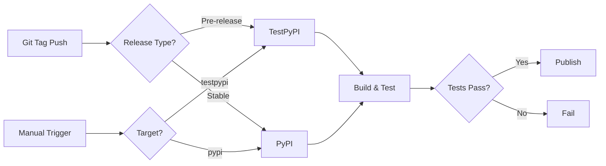

# GitHub Actions 자동 배포 설정 가이드

이 가이드는 GitHub Actions를 사용하여 TestPyPI 및 PyPI에 자동으로 배포하는 방법을 설명합니다.

## 🎯 개요

**Trusted Publishing (OIDC)**을 사용하면:
- ✅ API 토큰 불필요
- ✅ 보안 강화 (자격 증명 노출 없음)
- ✅ 태그 푸시 시 자동 배포
- ✅ 수동 배포도 가능

---

## 📋 설정 단계

### 1️⃣ TestPyPI에서 Trusted Publisher 등록

#### A. TestPyPI 계정 생성 (아직 없다면)
1. https://test.pypi.org/account/register/ 접속
2. 계정 생성 및 이메일 인증

#### B. Pending Publisher 추가

1. **TestPyPI 로그인** 후 이동: https://test.pypi.org/manage/account/publishing/
2. **"Pending publishers" 섹션**으로 스크롤
3. **"Add a new pending publisher" 클릭**
4. 다음 정보 입력:

   | 필드 | 값 |
   |------|-----|
   | **PyPI Project Name** | `code-trajectory` |
   | **Owner** | `SynTaek` |
   | **Repository name** | `code-trajectory-mcp` |
   | **Workflow name** | `publish.yml` |
   | **Environment name** | `testpypi` |

5. **"Add" 버튼 클릭**

> 💡 **Pending Publisher란?**  
> 아직 존재하지 않는 프로젝트를 위한 사전 승인입니다. 첫 배포 시 자동으로 일반 Publisher로 전환됩니다.

---

### 2️⃣ PyPI에서 Trusted Publisher 등록 (선택사항)

**⚠️ 주의:** PyPI는 프로젝트가 이미 존재해야 합니다. TestPyPI 테스트 후 진행하세요.

#### 첫 번째 PyPI 배포 (수동)

1. API 토큰 생성: https://pypi.org/manage/account/token/
2. 로컬에서 수동 배포:
   ```bash
   uv build
   uv pip install twine
   twine upload dist/*
   ```

#### Trusted Publisher 추가

1. **PyPI 로그인** 후 프로젝트로 이동: https://pypi.org/manage/project/code-trajectory/settings/publishing/
2. **"Add a new publisher" 클릭**
3. 다음 정보 입력:

   | 필드 | 값 |
   |------|-----|
   | **Owner** | `SynTaek` |
   | **Repository name** | `code-trajectory-mcp` |
   | **Workflow name** | `publish.yml` |
   | **Environment name** | `pypi` |

4. **"Add" 버튼 클릭**

---

## 🚀 사용 방법

### 방법 1: GitHub Release로 자동 배포 (추천)

#### TestPyPI 배포 (테스트용)
```bash
# Pre-release 태그 생성
git tag v0.1.2-beta.1
git push origin v0.1.2-beta.1

# GitHub에서 Release 생성 (Pre-release 체크)
```

#### PyPI 배포 (프로덕션)
```bash
# 정식 릴리스 태그 생성
git tag v0.1.2
git push origin v0.1.2

# GitHub에서 Release 생성 (Pre-release 체크 해제)
```

### 방법 2: 수동 워크플로우 실행

1. GitHub 저장소로 이동
2. **Actions** 탭 클릭
3. **"Publish to PyPI"** 워크플로우 선택
4. **"Run workflow"** 클릭
5. 배포 대상 선택:
   - `testpypi` - 테스트 환경
   - `pypi` - 프로덕션 환경

---

## 📊 자동화된 배포 흐름



---

## ✅ 배포 프로세스

워크플로우는 자동으로 다음을 수행합니다:

1. **빌드 단계**
   - ✅ 코드 체크아웃
   - ✅ Python 3.14 설치
   - ✅ 의존성 설치
   - ✅ 테스트 실행 (pytest)
   - ✅ 린팅 검사 (ruff, pyrefly)
   - ✅ 패키지 빌드

2. **배포 단계**
   - ✅ Trusted Publishing (OIDC) 사용
   - ✅ TestPyPI 또는 PyPI에 업로드
   - ✅ 자동 버전 관리

---

## 🔍 배포 확인

### TestPyPI
- **프로젝트 페이지:** https://test.pypi.org/project/code-trajectory/
- **설치 테스트:**
  ```bash
  uv pip install --index-url https://test.pypi.org/simple/ --extra-index-url https://pypi.org/simple/ code-trajectory
  ```

### PyPI
- **프로젝트 페이지:** https://pypi.org/project/code-trajectory/
- **설치:**
  ```bash
  pip install code-trajectory
  # 또는
  uv pip install code-trajectory
  ```

---

## 🛠️ 트러블슈팅

### ❌ "Publishing to TestPyPI failed"

**원인:** Pending Publisher가 설정되지 않았거나 정보가 일치하지 않음

**해결:**
1. TestPyPI에서 Pending Publisher 설정 확인
2. Workflow name이 `publish.yml`인지 확인
3. Environment name이 `testpypi`인지 확인

### ❌ "Environment protection rules not met"

**원인:** GitHub Environment가 설정되지 않음

**해결:**
1. GitHub 저장소 → Settings → Environments
2. `testpypi` 및 `pypi` environment 추가
3. Protection rules 설정 (선택사항)

### ❌ "Version already exists"

**원인:** 같은 버전을 재업로드하려고 시도

**해결:**
1. `pyproject.toml`에서 버전 번호 증가
2. 새 태그 생성 및 푸시

---

## 📝 버전 관리 전략

### Semantic Versioning 사용

- **v0.1.0** - 초기 릴리스
- **v0.1.1** - 패치 (버그 수정)
- **v0.2.0** - 마이너 (기능 추가)
- **v1.0.0** - 메이저 (Breaking Changes)

### Pre-release 태그

- **v0.1.1-alpha.1** - 알파 버전 (TestPyPI)
- **v0.1.1-beta.1** - 베타 버전 (TestPyPI)
- **v0.1.1-rc.1** - Release Candidate (TestPyPI)

---

## 🔐 보안 모범 사례

✅ **Trusted Publishing 사용** (추천)
- API 토큰 불필요
- OIDC 기반 인증
- GitHub Actions에 내장

❌ **API 토큰 사용** (레거시)
- GitHub Secrets에 저장 필요
- 주기적인 갱신 필요
- 보안 위험 증가

---

## 📚 추가 자료

- [PyPI Trusted Publishing 문서](https://docs.pypi.org/trusted-publishers/)
- [GitHub Actions 문서](https://docs.github.com/en/actions)
- [Python Packaging 가이드](https://packaging.python.org/)
